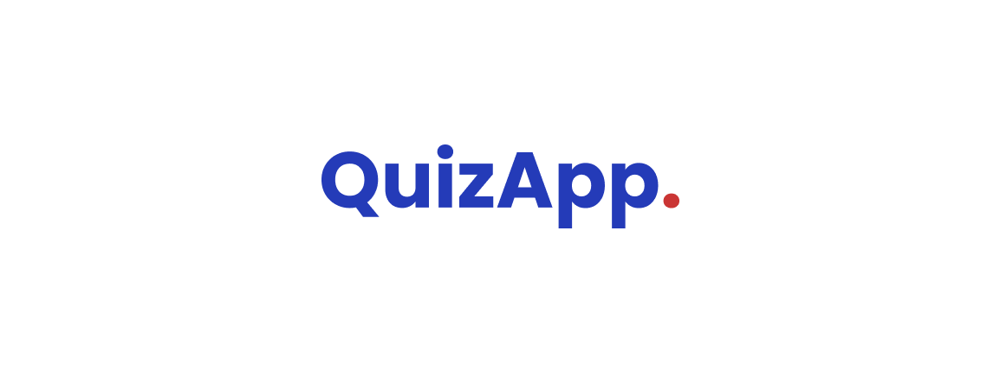
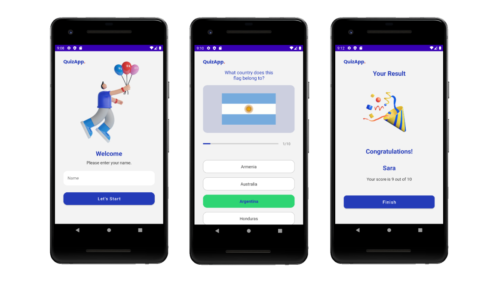

<h1 align="center">
    
</h1>
 

  
  
  

 

  :rocket: Projeto simples criado com o intuito de praticar e revisar alguns conceitos   básicos do desenvolvimento Android com Kotlin.
  O app é um Quiz sobre as bandeiras de alguns   países do mundo. No final o usuário consegue visualizar sua pontuação final.

<h1 align="center">
    
</h1>

  No projeto foi utilizado o conceito de Single-Activity, onde a Activity é utilizada como um   container para os Fragments. Também foi utilizado o Navigation Component e   Safe Args para transmitir dados entre os destinos.

 

  

 

  A lógica do projeto foi feita baseada no tutorial do <a href="https://www.youtube.com/c/tutorialsEU">tutorialsEU</a> com modificações feitas por mim.

  
Feito com ❤️ por Sara Cavalcante

